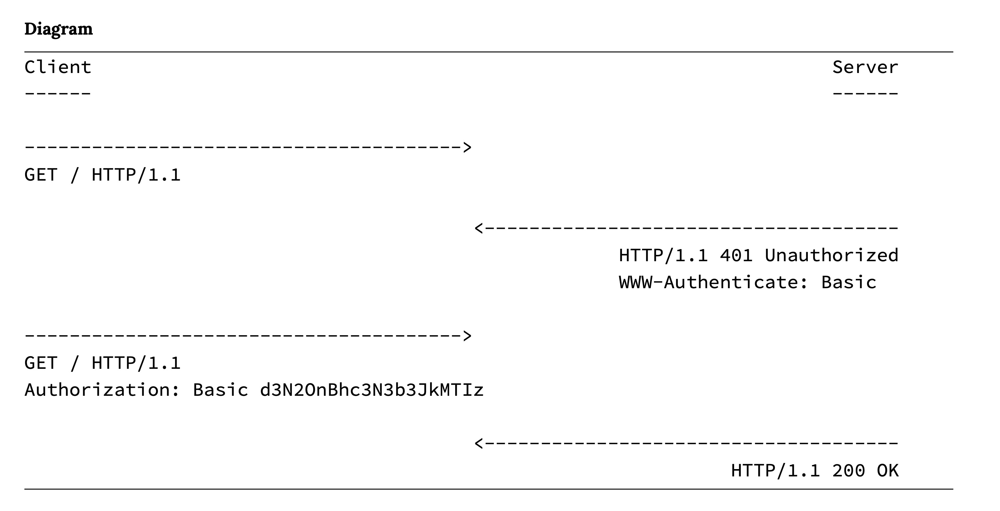
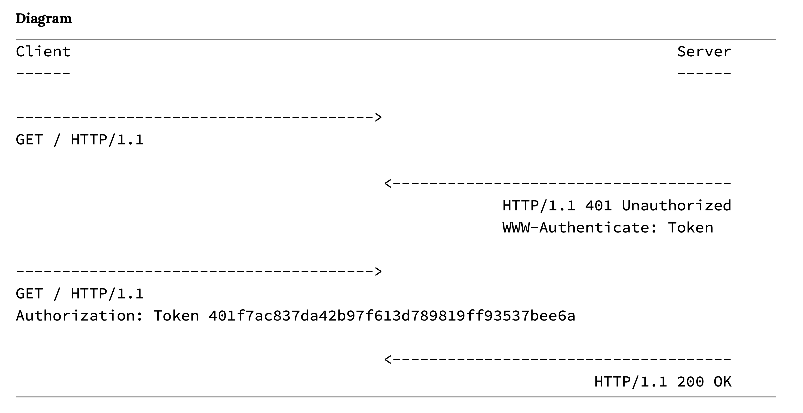

# User Authenication

When we looked at permissions, we were thinking about `authorization` - what someone is allowed to do.

We're going to look at `authentication` now - who someone is.

Django generally handles this easily for us if we're building our whole application in Python. But with a REST API things are slightly more tricky. As HTTP is stateless, there is no built-in way to remember if a user is authenticated from one request to the next.

There is no universally agreed-upon approach for how to do this but there are 4 built into Django and other packages that add things like JWTs.


# Basic Auth



Note that the authorization credentials sent are the unencrypted base64 encoded version of `<username>:<password>`.

The advantage of this approach is it's simplicity. 

The disadvantages are:

- on every single request the server must look up and verify the username and password, which is inefficient
- user credentials are being passed in clear text—not encrypted at all—over the internet
- user credentials need to be in our frontend source code


# Session Authentication

The basic flow looks like this:


1. A user enters their log in credentials (typically username/password)
2. The server verifies the credentials are correct and generates a session object that is then
stored in the database
3. TheserversendstheclientasessionID—notthesessionobjectitself—whichisstoredasa
cookie on the browser
4. On all future requests the session ID is included as an HTTP header and, if verified by the
database, the request proceeds
5. Once a user logs out of an application, the session ID is destroyed by both the client and
server
6. If the user later logs in again, a new session ID is generated and stored as a cookie on the
client

This is how the Django REST Framework frontend actually works. It's more secure than sending details over the web but it is only valid in the given browser, it doesn't work over multiple domains and the cookies is sent for every transaction - even those that don't need authentication.

# Token Authentication



There are multiple benefits to this approach. Since tokens are stored on the client, scaling the servers to maintain up-to-date session objects is no longer an issue. And tokens can be shared amongst multiple front-ends: the same token can represent a user on the website and the same user on a mobile app. The same session ID can not be shared amongst different front-ends, a major limitation.

A potential downside is that tokens can grow quite large. A token contains all user information, not just an id as with a session id/session object set up. Since the token is sent on every request, managing its size can become a performance issue.

Exactly how the token is implemented can also vary substantially. Django REST Frameworks’ built-in TokenAuthentication is deliberately quite basic. As a result, it does not support setting tokens to expire, which is a security improvement that can be added. It also only generates one token per user, so a user on a website and then later a mobile app will use the same token. Since information about the user is stored locally, this can cause problems with maintaining and updating two sets of client information. 

We'll implement the core Tokens and if we have time, JWTs.

# Adding Token Auth

1. In `settings.py` update the `REST_FRAMEWORK` setting:

```python
REST_FRAMEWORK = {
    "DEFAULT_PERMISSION_CLASSES": [
        "rest_framework.permissions.IsAuthenticated",
        ],
    "DEFAULT_AUTHENTICATION_CLASSES": [ # new
        "rest_framework.authentication.SessionAuthentication",
        "rest_framework.authentication.TokenAuthentication",  
    ],
}
```

We use both because the Session is used for the DRF frontend.

2. Add `rest_framework.authtoken` to our `INSTALLED_APPS`:

```python
INSTALLED_APPS = [
    "django.contrib.admin",
    "django.contrib.auth",
    "django.contrib.contenttypes",
    "django.contrib.sessions",
    "django.contrib.messages",
    "django.contrib.staticfiles",
    # 3rd-party apps
    "rest_framework",
    "corsheaders",
    "rest_framework.authtoken",  # new
		# 1st-party
]
```

3. Make and apply your database migrations.

4. View the Django admin panel and your should see Auth Token's now. Viewing inside, there are none yet. We need to provide a way for users to create tokens.

We could try to build this ourselves but this is not an area we want to make mistakes. So, we'll lean on a two third-party apps.

### dj-rest-auth

This will allow us to add log in, log out and password reset API endpoints.

1. Install with `poetry add dj-rest-auth`.

2. Add to our installed apps.

```python
INSTALLED_APPS = [
    "django.contrib.admin",
    "django.contrib.auth",
    "django.contrib.contenttypes",
    "django.contrib.sessions",
    "django.contrib.messages",
    "django.contrib.staticfiles",
    # 3rd-party apps
    "rest_framework",
    "corsheaders",
    "rest_framework.authtoken",  
		"dj_rest_auth", # new
		# 1st-party
]
```

3. Update your `urls.py`

```python
from django.contrib import admin from django.urls import path, include
urlpatterns = [
    path("admin/", admin.site.urls),
		# ...
    path("api-auth/", include("rest_framework.urls")),
    path("api/dj-rest-auth/", include("dj_rest_auth.urls")),  # new
]
```

4. Navigate to `http://localhost:8000/api/dj-rest-auth/login` to login.

The other routes added are:

- `/logout` 
- `/password/reset`
- `/password/reset/confirm`

## django-allauth

Next up is our user registration, or sign up, endpoint. Traditional Django does not ship with built- in views or URLs for user registration and neither does Django REST Framework. Which means we need to write our own code from scratch; a somewhat risky approach given the seriousness– and security implications–of getting this wrong.

Our Django admin panel is just for admin so we can't lean on that.

1. Add django-allauth with `poetry add django-allauth~=0.48.0`

2. Then update our INSTALLED_APPS setting to add several new configs:
• django.contrib.sites
• allauth
• allauth.account
• allauth.socialaccount
• dj_rest_auth.registration

```python
INSTALLED_APPS = [
    "django.contrib.admin",
    "django.contrib.auth",
    "django.contrib.contenttypes",
    "django.contrib.sessions",
    "django.contrib.messages",
    "django.contrib.staticfiles",
    "django.contrib.sites",  # new
    # 3rd-party apps
    "rest_framework",
    "corsheaders",
    "rest_framework.authtoken",
    "allauth",  # new
    "allauth.account",  # new
    "allauth.socialaccount",  # new
    "dj_rest_auth",
    "dj_rest_auth.registration",  # new
		# 1st party
]
```

3. `django-allauth` needs to be added to the TEMPLATES config.

```python
TEMPLATES = [
    {
			"BACKEND": "django.template.backends.django.DjangoTemplates", "DIRS": [],
			"APP_DIRS": True,
			"OPTIONS": {
            "context_processors": [
                "django.template.context_processors.debug",
                "django.template.context_processors.request",
                "django.contrib.auth.context_processors.auth",
                "django.contrib.messages.context_processors.messages",
                "django.template.context_processors.request",  # new
						], 
			},
		}
]
```

4. Add an email backend. For now, we'll just print to the console but here you could tie into services like Mailgun or Sendgrid.

```python
EMAIL_BACKEND = "django.core.mail.backends.console.EmailBackend"  # new
```

5. Give your site an id

```python
SITE_ID = 1  # new
```

6. Run your migrations.

7. Update your URLs in `url.py`

```python
from django.contrib import admin from django.urls import path, include
urlpatterns = [
    path("admin/", admin.site.urls),
		# ...
    path("api-auth/", include("rest_framework.urls")),
    path("api/dj-rest-auth/", include("dj_rest_auth.urls")),
    path("api/dj-rest-auth/registration/",  # new
          include("dj_rest_auth.registration.urls")),
]
```

8. Register for a new user account at `http://localhost:8000/api/dj-rest-auth/registration/`

9. Get the Token from the terminal and use that in an API request.